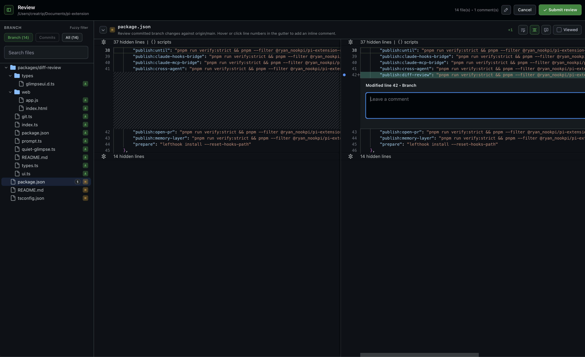

# @ryan_nookpi/pi-extension-diff-review

A native diff review extension for pi.

It opens a dedicated review window for the current repository so you can inspect the branch diff, review individual commits, browse all changed files, and collect feedback before sending it back into the editor.



## Install

```bash
pi install npm:@ryan_nookpi/pi-extension-diff-review
```

## What it does

- registers the `/diff-review` command
- opens a native review window for the current git repository
- supports branch, per-commit, and all-files review scopes
- detects local file changes while the review window is open and offers a manual refresh without polling
- lets you leave overall comments and file/line comments
- appends the collected feedback back into the pi editor as a follow-up prompt

## Requirements

- pi
- a git repository
- `glimpseui` runtime installed through the package dependency

## Inspiration

Inspired by [badlogic/pi-diff-review](https://github.com/badlogic/pi-diff-review).
