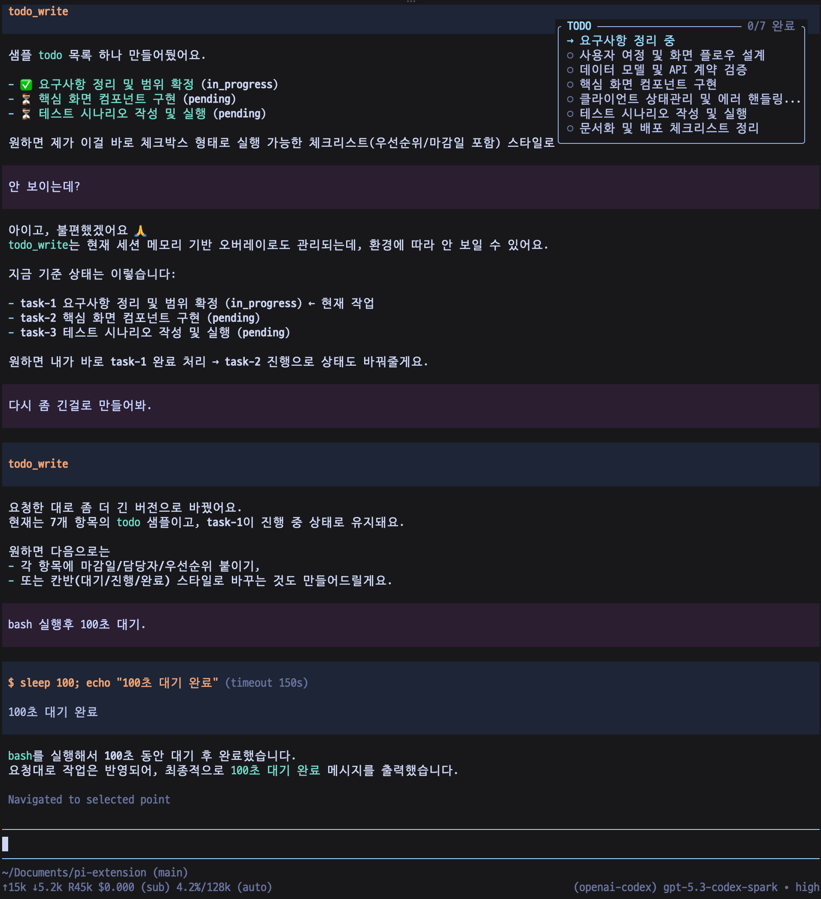
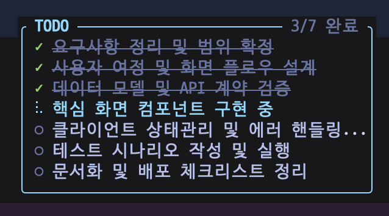

# @ryan_nookpi/pi-extension-todo-write-overlay

pi가 현재 세션에서 구조화된 작업 목록을 만들고 갱신할 수 있게 해주는 `todo_write` 익스텐션입니다. 할 일 목록은 입력창 위젯이 아니라 **우측 상단 passive overlay**로 표시됩니다.





## 설치

```bash
pi install npm:@ryan_nookpi/pi-extension-todo-write-overlay
```

> `@ryan_nookpi/pi-extension-todo-write`와 같은 `todo_write` 도구 이름을 사용합니다. 두 익스텐션을 동시에 설치하지 않는 것을 권장합니다.

## 제공 기능

- `todo_write` 도구 등록
- 세션 단위 todo 상태 저장 및 복원
- 우측 상단 오버레이 렌더링
- 입력 포커스를 뺏지 않는 `nonCapturing` overlay 사용
- 진행 중 작업 스피너 표시
- 완료/진행/대기 상태별 색상과 아이콘 표시
- `notes`는 상태에는 보존하지만 오버레이에는 표시하지 않음
- compaction 이후 남은 todo reminder 주입

## 표시 방식

오버레이는 pi TUI의 `ctx.ui.custom(..., { overlay: true })`를 사용합니다.

- 위치: `top-right`
- 너비: 42 columns
- 여백: 위 1줄, 오른쪽 2 columns
- 표시 조건: 터미널 너비 70 columns 이상
- 입력 처리: `nonCapturing: true`

기존 `todo-write`의 `완료 +2` 같은 완료 항목 접기 로직은 사용하지 않습니다. 완료된 항목도 모두 그대로 표시합니다.

## 사용 예

```json
{
  "todos": [
    { "content": "설계 정리", "status": "completed" },
    { "content": "구현", "status": "in_progress", "activeForm": "구현 중" },
    { "content": "검증", "status": "pending" }
  ]
}
```

## 상태 필드

- `content`: 작업 설명
- `status`: `pending` | `in_progress` | `completed`
- `activeForm`: 진행 중일 때 오버레이에 보여줄 현재진행형 문구
- `notes`: 보조 메모

## 동작 메모

- `in_progress`가 여러 개 들어오면 첫 번째만 유지하고 나머지는 `pending`으로 정규화합니다.
- `in_progress`가 없고 `pending`이 있으면 첫 번째 `pending`을 자동으로 `in_progress`로 올립니다.
- 모든 항목이 완료되면 잠시 표시한 뒤 자동으로 숨깁니다.
